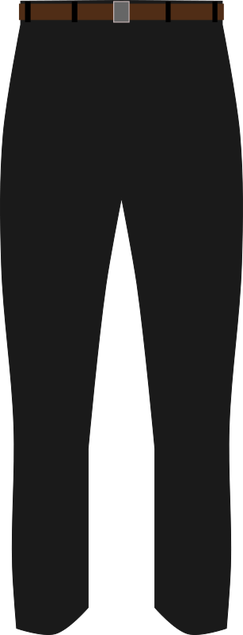

# Testing an Order Processor

In this project, you will write tests that check if a program is working correctly.

There are two steps to the project. First, you will read the code for an "order processor". Then, you will write a full set of tests that confirm that the implementation is working correctly.


## Part One: Understanding an order processor

Imagine that you are working on server code for an online store. The other parts of the program send the OrderProcessor a json file with an order, and the order processor interprets it and deducts from the inventory.

An example order looks like this,

```json
[
    {"type": "jacket", "brand": "fruche", "quantity": "2"},
    {"type": "slacks", "brand": "kente", "quantity": "1"}
]
```

The store has 3 types of merchandise: `jacket`, `slacks`, and `pair_of_shoes`. There are 3 brands the store sells, `fruche`, `onalaja` and `kente`. (For this project these are the only attributes needed as part of the order).


Every item starts off with a quantity of 20 in the inventory. So, in the beginning, there will be 20 Fruche jackets, 20 Onalaja jackets, 20 Kente jackets, 20 Fruche slacks, 20 Onalaja slacks, etc. For simplicity, this project won't connect to a database or persist the results to a file - it will just print the results. The inventories reset to 20 each run.

For the example input, the program should print this as a result:

```
Remaining inventory:
jacket fruche 18
jacket onalaja 20
jacket kente 20
slacks fruche 20
slacks onalaja 20
slacks kente 19
pair_of_shoes fruche 20
pair_of_shoes onalaja 20
pair_of_shoes kente 20
```

If there is at least one jacket, slacks, and pair\_of\_shoes from the same brand in an order, we will call this a full outfit. When an order contains one or more full outfits for a brand, the program should print "Contains full outfit for a brand" at the end.

So for the example input:

```json
[
    {"type": "jacket", "brand": "fruche", "quantity": "2"},
    {"type": "slacks", "brand": "kente", "quantity": "1"},
    {"type": "slacks", "brand": "fruche", "quantity": "1"},
    {"type": "pair_of_shoes", "brand": "fruche", "quantity": "1"}
]

```

The output should be this:

```
Remaining inventory:
jacket fruche 18
jacket onalaja 20
jacket kente 20
slacks fruche 19
slacks onalaja 20
slacks kente 19
pair_of_shoes fruche 19
pair_of_shoes onalaja 20
pair_of_shoes kente 20
Contains full outfit for a brand
```

(If there are jackets from fruche, slacks from fruche, and pair\_of\_shoes from kente, this does not count as a full outfit because they were not from the same brand).


You don't need to write any code for part 1, just do the following to understand what the program is doing:

* Run `main.py` and see the results.
* Edit `main.py` so that points to the other examples like `example2.json`, and run it to see the results.
* Read through `implementations/store_order_processor.py` and understand what it does.
  * Find the part of code that raises an exception if the brand for an order is not one of the 3 supported brands.
  * Understand what the `search_in_list` method does.

In summary, here are the features that exist in `implementations/store_order_processor.py`:

* At the end, the inventory is shown.
* Ordering an item subtracts it from the inventory.
* If there is a full outfit, show the "Contains full outfit" string.
* An order that uses more than the available inventory is not valid.
* If input is not valid, raise an `StoreOrderProcessorException`.


## Part Two: Writing Tests

The next part of the assignment is to write tests that check that the `StoreOrderProcessor` implementation works correctly. For this project, unlike the others, we have given you the actual code and your task is to write the tests.

Please edit the file `test_store_order_processor.py`. See the `TODO` comments in the file. For each `TODO` comment, write a test. The existing tests in the file are good examples to go off of.

Once you have written the tests, try running them by running `test_store_order_processor.py`. All of the tests should pass.

The next step is fun. Notice all of the files like `implementations/with_bugs_01.py`. These are all different Store Order Processors that have bugs, realistic bugs that could happen. If the tests are working correctly, they will detect the bugs. In other words - if you pass a buggy implementation to your tests, you would expect one or more of the tests to fail! You can try this. Read the buggy implementations - a comment at the top of the file describes the problem.

We have provided a file `test_tests.py` - a Python program that tests the tests. It loops through every `with_bugs` file, runs the tests on it, and confirms that the tests have a failure. If the tests did not have a failure, they are allowing a buggy program to pass, which isn't right.

You can run this file, and if it runs with no errors, your project is complete. (This script is how the project is autograded. You will see the GitHub actions status turn green when your project is complete.).

           

